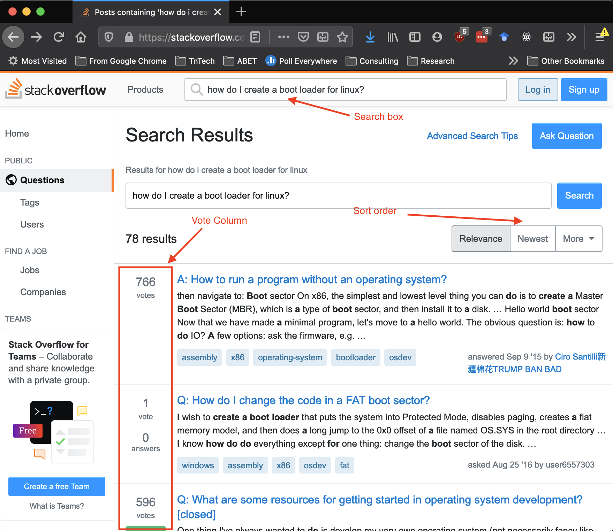
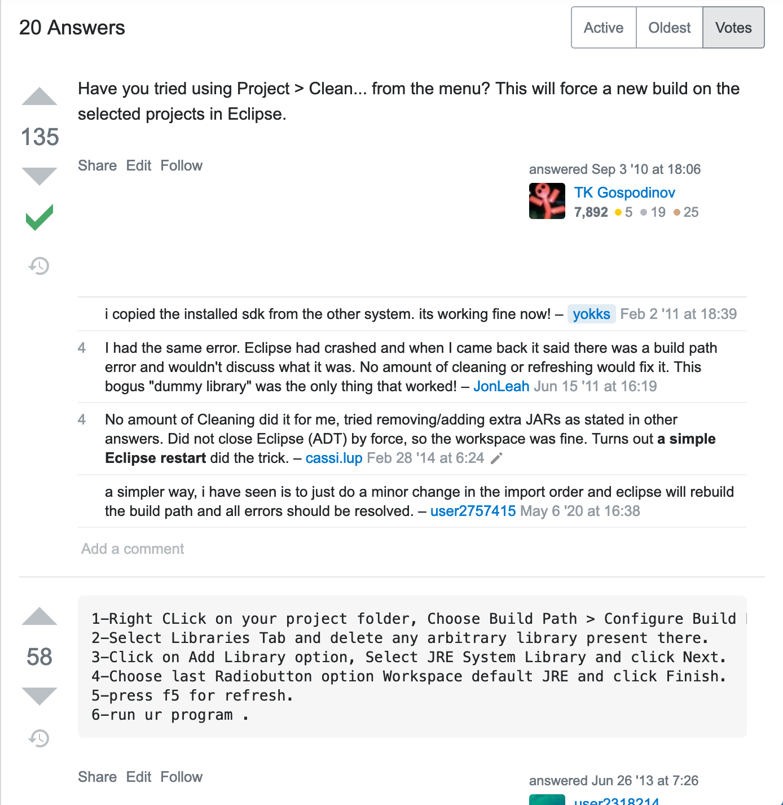

## Stackoverflow
### CSC 2310 Spring 2021 Lab-08

In this lab you will explore the use of [Stackoverflow.com](https://www.stackoverflow.com) as a source for seeking answers to common programming problems.

* What is stackoverflow?
* Questions on Stackoverflow
* Interpreting answers

### Pre-requisites
There are no pre-requisites for this lab except that you will need an Internet access and a web-browser.

### What is Stackoverflow?
Stackoverflow ([https://stackoverflow.com](https://stackoverflow.com)) is a reputation-based site for
posing and answering questions typically related to
the technical domain. As a reputation-based system, the site provides a means for interpreting the quality of the responses according to the use of votes and
the reputation of individual users.

When programming it is often the case that you will have at least one browser tab open to the Stackoverflow site. Indeed, it is not uncommon to have
one display monitor devoted specifically to finding
answers to common issues encountered in programming.

#### Create an account
It is suggested that you create an account on Stackoverflow to create a profile. You can do this [here](https://stackoverflow.com/users/signup?ssrc=head&returnurl=%2fusers%2fstory%2fcurrent) - ([https://stackoverflow.com/users/signup?ssrc=head&returnurl=%2fusers%2fstory%2fcurrent](https://stackoverflow.com/users/signup?ssrc=head&returnurl=%2fusers%2fstory%2fcurrent)). 

#### Take the tour
After creating an account, take the tour at https://stackoverflow.com/tour.

### Questions on Stackoverflow
Stackoverflow is primarily concerned with the following:

* Asking Questions: https://stackoverflow.com/help/how-to-ask
* Answering Questions: https://stackoverflow.com/help/how-to-answer
* Searching for answers: https://stackoverflow.com/help/searching

Each of the above links provides an overview of how to do each.
Note that there are limitations to what you can do on the site until you have built up a certain reputation score. However, you are able to ask, answer, and search with little or no issue regardless of your reputation.
When you use the search feature you will be presented with a page that looks similar to the following:

Notice two things in particular:
* Sort Order - you can change the filtered order so that you see questions and responses according to *relevance*, *newest*, and *votes* (not shown).
* Vote Column - shows the number of votes that a question received, which provides you a sense of the popularity of a question.

### Interpreting answers
When you find an answer that is relevant you still have the job of selecting an appropriate solution.

* While you may find direct answers to your problem, you may have to interpret the answers to determine what is different from your own particular situation. In particular, you'll have to use critical thinking to determine relevancy of both the question and answer. As such:
  * Should you rewrite the query?
  * Should you look at other potential questions that were retrieved in the search?
  * Is there some aspect of the answer that is the same as my situation that could apply? Remember that the names of classes or other objects will probably be different but the problem may be the same.
* Some answers may be inherently risky to try so you should try to understand the answer before incorporating it into your code.
  * You could use git's branching capability to create a branch for trying out some solution to avoid having to go back to your original solution.
  * You should pay particular attention to whether the solution creates a cybersecurity issue.
* Look at other solutions that have been suggested rather than just going to the first one in the list. For instance, take a look at the following answer. The first is the top voted, but the second answer may be more appropriate.

### Things to try
* How do I uncommit in git?
* How do I unstage in git?
* classnotfoundexception
